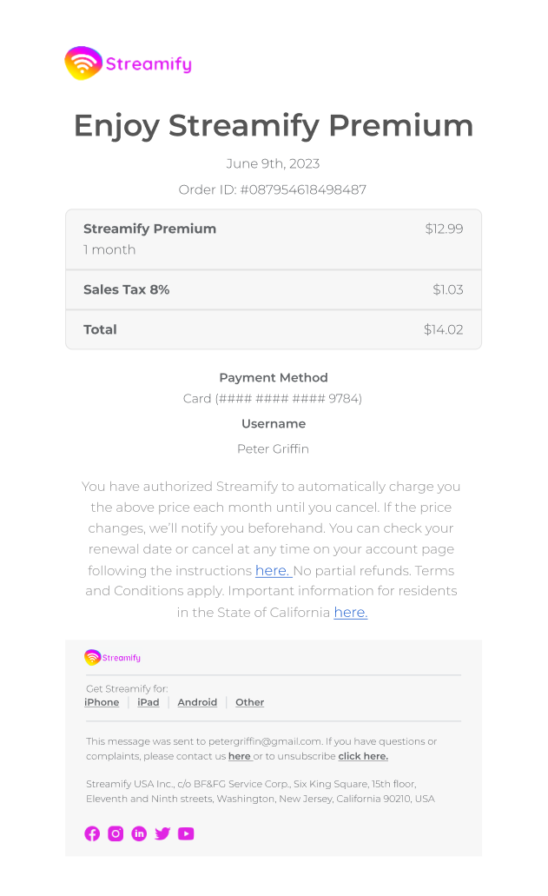

<h1>Streamify</h1>

<h3>About the Project</h3>

A transactional email I coded for a fictional music streaming store called Streamify. The goal of this email is to confirm the customer's monthly subscription to the streaming service.The email is responsive and works on all email clients. I used HTML, CSS, and Photoshop to create the email and Email on Acid to test it on different email clients.

👉 Live Demo <a href="https://streamify-beryl.vercel.app/" target="_blank" rel="noopener">here.</a> 
 

<h3>Email Screenshot</h3>

 
</img>
